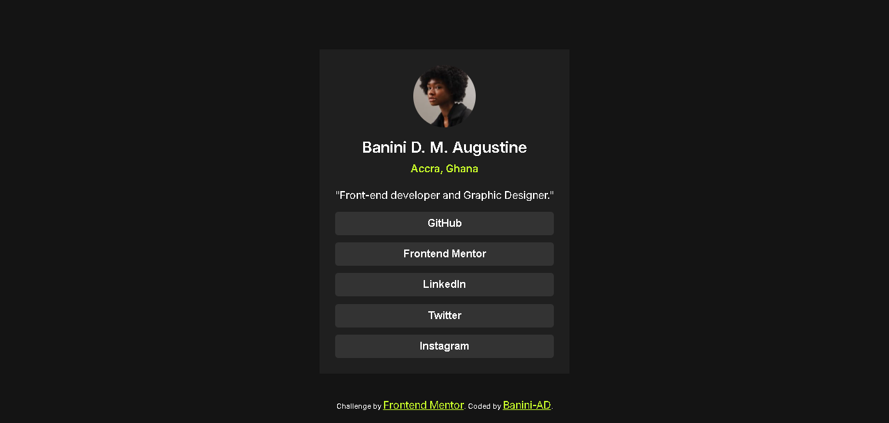
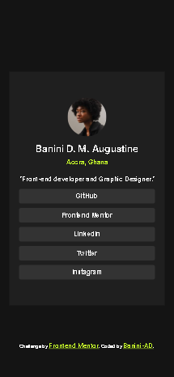

# Frontend Mentor - Blog preview card solution

This is a solution to the [Blog preview card challenge on Frontend Mentor](https://www.frontendmentor.io/challenges/blog-preview-card-ckPaj01IcS). Frontend Mentor challenges help you improve your coding skills by building realistic projects.

## Table of contents

- [Overview](#overview)
  - [The challenge](#the-challenge)
  - [Screenshot](#screenshot)
  - [Links](#links)
- [My process](#my-process)
  - [Built with](#built-with)
  - [What I learned](#what-i-learned)
  - [Continued development](#continued-development)
  - [Useful resources](#useful-resources)
- [Author](#author)

## Overview

### The challenge

### Screenshot

-Desktop Preview: 
-Mobile Preview: 

### Links

- Solution URL: [My Solution](https://github.com/Banini-AD/Social-links)
- Live Site URL: [Live Site](https://your-live-site-url.com)

## My process

### Built with

- Semantic HTML5 markup
- CSS custom properties
- Flexbox
- Mobile-first workflow

### What I learned

This project helped me  learn about another web accessibility called "keyboard-navigation". It showed me how to use keyboard-navigation to improve web accessibility when creating web project.

I learned that using these keyboard-navigation can make websites more accessible to everyone. It also helps to ensure better SEO to help my project rank high on search engines (since Search engines favor accessible sites).

Overall, this project greatly expanded my knowledge of web development best practices and taught me more about how to build contents that are favorable to search engines through better SEO . It empowered me to create better and more efficient SEO content.

### Continued development

I would like to improve my code for it to become more favorable by search-engines, so that my website does not rank low on search engines. This will help me create better and more user-friendly websites that will rank high among it's competitors.

### Useful resources

- [Quentin Bellanger](https://quentin-bellanger.com/blog/keyboard-navigation/) - This blog post from Quentin Bellanger gave me a complete theory on what keyboard navigation. I really liked the way the blog post was divides into different sections and will use it going forward.I'd recommend it to anyone still learning this concept.

- [Youtube](https://www.youtube.com) - This helped me get to see how these keyboard navigation concept was applied in projects. I'd recommend it to anyone still learning this concept.

## Author

- Website - [Banini-AD](https://www.your-site.com).
- Frontend Mentor - [@Banini-AD](https://www.frontendmentor.io/profile/Banini-AD).
